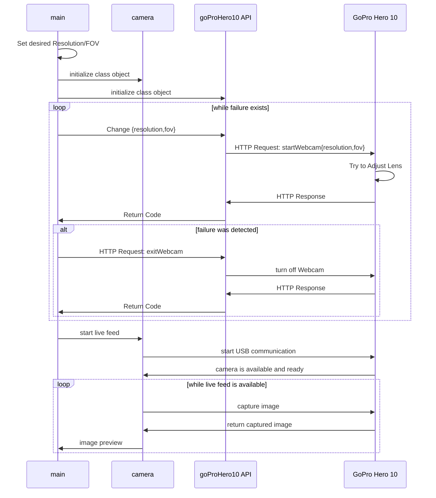

# GO PRO HERO 10

## Table of Contents
- [GoPro Hero 10 Black](#gopro-hero-10-black)
    - [Battery Specs](#battery-specs)
    - [Video Specs](#video-specs)
- [Sequence Diagram](#sequence-diagram)
    - [Elements](#elements)
    - [Diagram](#diagram)
- [Webcam Constraints](#webcam-constraints)
- [Preview Stream](#preview-stream)
- [Useful Links](#useful-links)


## GoPro Hero 10 Black

- Product manual: [HERO 10 Black](https://gopro.com/content/dam/help/hero10-black/manuals/HERO10Black_UM_ENG_REVB.pdf) (video/photo specs starting page nr.63/77)

<br>

### Battery Specs

```
RECORDING WHEN PLUGGED INTO A POWER SOURCE
You can use the USB-C cable that came with your camera to shoot videos and photos while your camera is plugged in to a USB-charging adapter, the GoPro Supercharger, or other external power source.

This is perfect for capturing long videos and time lapse events.

Be careful not to touch the area near the SD card slot when recording.

Disturbing the SD card could interrupt or stop the recording. Your camera will let you know if this happens. Your content will not be damaged or lost as a result of this disturbance, but you may need to restart your camera to continue.

Even though your camera is charging, the battery will not charge during recording. It will start charging when you stop recording.

You cannot record while your camera is plugged into a computer
```

Thus, when using the GoPro as a webcam, the battery drains faster than what it is able to charge, while plugged in to 3.0 USB.

<br>

### Video Specs

#### Aspect Ratio


<br>

#### Digital Lenses


<br>

#### Resolutions


```
Shooting high-resolution or high-fps video when it’s warm out can cause your camera to heat up and use more power.
```


<br>

<br>

<br>

## **Sequence Diagram**

### Elements:
- **main** (`main.py`): main script
- **goProHero10 API** (`goProHero10.py`): _goProHero10 class_ that handles the HTTP communication with the GoPro Hero 10 Camera (Hardware)
- **camera** (`camera.py`): _class_ that implements and handles, through _openCV_, the live feed, keypress events, image processing, etc;
- **GoPro Hero 10**: hardware

### Diagram



## Webcam Constraints

From [GoPro Support](https://community.gopro.com/s/article/GoPro-Webcam?language=en_US):
```
Webcam Mode resolution limitations: "Here you can choose between [1080p] (default) or [720p]."

    Webcam Resolution
    ID 	Resolution 	Supported Cameras
    4 	480p 	Hero 10 Black, Hero 9 Black
    7 	720p 	Hero 12 Black, Hero 9 Black, Hero 10 Black, Hero 11 Black
    12 	1080p 	Hero 12 Black, Hero 9 Black, Hero 10 Black, Hero 11 Black

    Webcam Field-of-View
    ID 	FOV 	Supported Cameras
    0 	Wide 	Hero 12 Black, Hero 9 Black, Hero 10 Black, Hero 11 Black
    2 	Narrow 	Hero 12 Black, Hero 9 Black, Hero 10 Black, Hero 11 Black
    3 	Superview 	Hero 12 Black, Hero 9 Black, Hero 10 Black, Hero 11 Black
    4 	Linear 	Hero 12 Black, Hero 9 Black, Hero 10 Black, Hero 11 Black
```
## Preview Stream

OBS: **Preview Stream** is not supported on GoPro Hero 10

```
When the preview stream is started, the camera starts up a UDP client and begins writing MPEG Transport Stream data to the client on port 8554. In order to stream this data, the client must implement a UDP connection that binds to the same port and decode the data.

**Start Preview Stream**

Supported Protocols:
USB
WIFI

query Parameters
port, integer
Example: port=8556

Port to use for Preview Stream. Defaults to 8554 if not set

Not supported on:
    Hero 11 Black Mini
    Hero 11 Black
    **Hero 10 Black**
    Hero 9 Black


```

## Useful Links

- Open GoPro HTTP API: [OpenGoPro/HTTP](https://gopro.github.io/OpenGoPro/http)
- GoPro Support webpage: [GoPro-Webcam](https://community.gopro.com/s/article/GoPro-Webcam?language=en_US)

