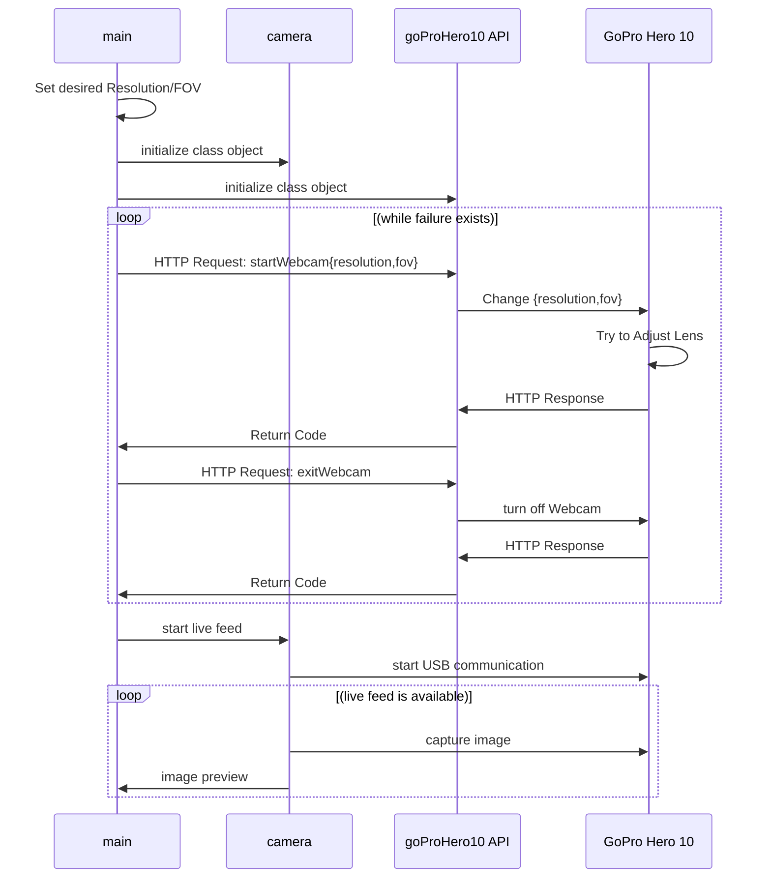

# GO PRO HERO 10

## **Sequence Diagram**

Elements:
- **main**: main script
- **goProHero10 API**: [goProHero10] class that handles the HTTP communication with the GoPro Hero 10 Camera (Hardware)
- **camera**: [class] that implements and handles, through _openCV_, the live feed, keypress events, image processing, etc;
- **GoPro Hero 10**: hardware

loop Every minute
        John-->Alice: Great!
    end
