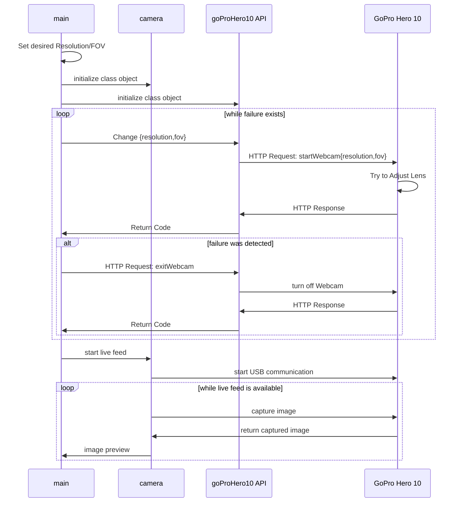

# GO PRO HERO 10

## **Sequence Diagram**

Elements:
- **main** (`main.py`): main script
- **goProHero10 API** (`goProHero10.py`): _goProHero10 class_ that handles the HTTP communication with the GoPro Hero 10 Camera (Hardware)
- **camera** (`camera.py`): _class_ that implements and handles, through _openCV_, the live feed, keypress events, image processing, etc;
- **GoPro Hero 10**: hardware

